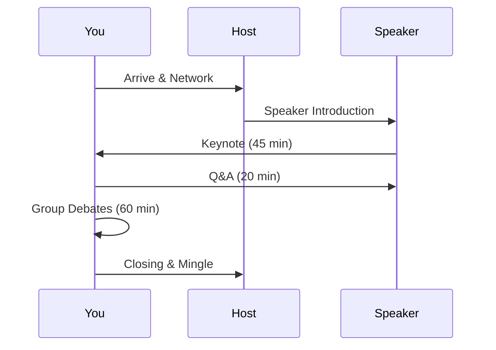

## Overview

Whiff of Grape hosts monthly events in Toronto where you connect with like-minded individuals through inspiring talks and lively debates. These gatherings feature renowned speakers who share insights on diverse topics, from philosophy to current affairs. You participate actively, fostering meaningful discussions and expanding your network. Expect a structured format that balances presentations, Q&A sessions, and open debates.

<Callout kind="info">
  Events occur on the first Thursday of each month at 7 PM EST. Check your invitation or member portal for the latest venue details.
</Callout>

## Event Formats and Schedules

Whiff of Grape events follow a consistent structure to maximize engagement. You arrive for networking, enjoy a keynote, join debates, and wrap up with informal chats.

| Month       | Date              | Theme                  | Venue                  |
|-------------|-------------------|------------------------|------------------------|
| October    | 2024-10-03       | Ethics in AI          | Toronto Reference Library |
| November   | 2024-11-07       | Climate Action        | Royal Ontario Museum   |
| December   | 2024-12-05       | Future of Work        | MaRS Discovery District|

## Renowned Speakers and Topics

Our speaker series brings thought leaders to Toronto. Past speakers include philosophers, scientists, and journalists discussing provocative topics.

<Tabs>
  <Tab title="Upcoming" icon="calendar">
    - **Dr. Elena Vasquez**: AI Ethics – Explore moral dilemmas in machine learning.
    - **Prof. Liam Chen**: Climate Strategies – Practical steps for urban sustainability.
  </Tab>
  <Tab title="Past Highlights" icon="history">
    - **Sarah Patel**, Journalist: "Media Bias in 2024" – Challenged assumptions on news integrity.
    - **Dr. Marcus Reed**, Philosopher: "Free Will Debate" – Sparked heated two-hour discussion.
  </Tab>
</Tabs>

## Tips for Effective Participation in Debates

Prepare to contribute thoughtfully. Follow these steps to make your voice heard.

<Steps>
  <Step title="Research the Topic" icon="book-open">
    Review the speaker's bio and recent articles. Form 2-3 key questions or counterpoints.
  </Step>
  <Step title="Listen Actively" icon="volume">
    Note agreements and disagreements during the keynote. Avoid interrupting.
  </Step>
  <Step title="Speak Concisely" icon="message-circle">
    Limit responses to 1-2 minutes. Use "I believe..." to own your views.
  </Step>
  <Step title="Engage Respectfully" icon="handshake">
    Acknowledge others' points. Debate ideas, not people.
  </Step>
</Steps>

<Callout kind="tip">
  Practice with our debate prep resources in the member portal.
</Callout>

## Networking Opportunities During Gatherings

Maximize connections at every event. Structured breaks and post-debate mingles provide prime times.

<Columns cols={2}>
  <Card title="Pre-Event Mixer" icon="coffee" href="#">
    Arrive 30 minutes early. Share your interest in the topic to start conversations.
  </Card>
  <Card title="Breakout Sessions" icon="users" href="#">
    Join small groups for themed chats. Exchange contacts via the Whiff app.
  </Card>
  <Card title="Post-Event Drinks" icon="toast" href="#">
    Casual venue extension. Follow up on debate points over drinks.
  </Card>
  <Card title="Follow-Up" icon="mail" href="#">
    Send thank-you notes within 48 hours. Propose coffee chats.
  </Card>
</Columns>

<Expandable title="Advanced Networking Strategies" default-open="false">
  Target 5 meaningful interactions per event. Use the `speaker-topic-interest` framework: compliment the speaker, share your topic insight, express interest in future collaboration.
</Expandable>